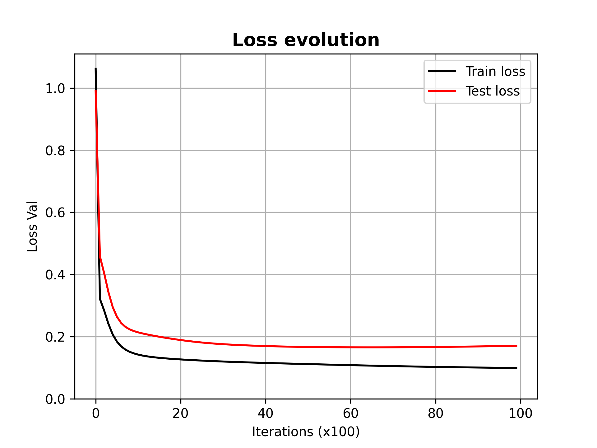

# Deep Learning Practice 1 report document

*Basic MLP implementation with Numpy/PyTorch using optimizers and autograd*

Group 8

Andreu Garcies (240618), Alejandro Fernández (242349), Marc Aguilar (242192)

> **Environment note**: We have worked in a local installation of `Python 3.10.9`. The libraries used (and their version) can be found in the `requirements.txt` file. You can install these dependencies with the following command:
>
> ```bash
> python -m pip install --upgrade -r requirements.txt
> ```

## Exercise 1. Implement a multi-layer perceptron

First of all, after loading both train and test data we normalized it. Our first approach was doing it by dividing by the maximum value, but we were not getting correct results. Therefore, we decided to do it by substracting the mean and dividing by the standard deviation. 

Here we can observe both plots, before  and after normalizing the dataset.


### MLP class

In order to implement the multi layer perceptron (MLP) we used the class structure that we were given in the examples. We kept the sigmoid as the activation function but we changed the loss, since the MSE was not the appropiate function for a classification problem. Our choice was the Cross Entropy loss since it is used for solving classification problems, as in our case. We changed both the `loss` and added `lossPrime` where we computed the derivative, consequently slightly modifying the `backward` to use this new function. 

Our last modification to the MLP class was adding the parameter `update` to the `forward` function. We needed to do the plots where we compared the evolution of the loss between train and test data. 

### Train and test phase
We used the structure of the `train` function that we were given but we added another loss list in which we stored the values of the loss for the **test data**.

We decided to keep both the number of epochs to `epoch=10000` and the learning rate `lr=0.01` for training. On the other hand, we set the number of **hidden neurons** up to **20** We can observe that the accuracy for the training dataset is very high **(97%)** as we initially expected. It only misclassifies 3 datapoints. 


Then, regarding the evolution of the loss we can observe how the test one is higher than the train one and there is not a significant sign of overfitting. From iteration 80 the test loss seems to grow a little bit so we could get a little bit of overfitting but not very significant.



Lastly, the classification of the test dataset gives us very good results too. As we can observe, it only misclassifies 3 datapoints. We reach an accuracy of **(88%)**, which is quite high. 


## Exercise 2. Implement SGG with momentum

### Implementation details

In this section we will focus on explaining what difficulties we encountered to justify our implementation choices. The foremost detail to remark is what **version of momentum we have decided to implement**. At first we settled for the version that multiplies the gradient by $1 - \beta$:

$$
\displaylines{
V_t = \beta V_{t-1} + (1-\beta)\nabla_wL(W, X, y) \\
W = W - \alpha V_t
}
$$

But after comparing the results with the standard Stochastic Gradient Descent we saw that the results were not as expected. After some thinking, we realised that we had forgotten about scaling the learning rate, otherwise its value was not comparable between exercises. To avoid this type of confusions, we thought that it was better to implement the second alternative, which uses a comparable learning rate:
$$
\displaylines{
V_t = \beta V_{t-1} + \alpha\nabla_wL(W, X, y) \\
W = W - V_t
}
$$
Other details that should be noted is that we have used a different moving average for each layer, because the weights update in each layer can be completely different. Furthermore, all $V_t$ are initialised to $0$ at the beginning. With this implementation, the result that we obtained was the following one:


It is clear that the addition of momentum has a positive effect, both in time required to reach the minimum and the minimum error that we get. It is important to note that we have used a fixed random seed to ensure that the results are easily comparable.

### Trying multiple values of $\beta$

When trying multiple values of $\beta$ we have also ensured to have the same random numbers for each test, to reduce as many distortion of the results as possible.


The result obtained is pretty straightforward to interpret. The higher the value of $\beta$ (up to $0.9$), the better the result. This should not come as a big surprise, as a small value of $\beta$ implies that we significantly reduce the effect of the momentum. This results is in line with the rule of thumb of using a beta of $0.9$ as a good starting point.

## Exercise 3. Implement the MLP using PyTorch

Once we implemented the MLP and tested that it worked as expected, we implemented the neural network using `PyTorch` and started changing the hyperparameters to understand how the network behaved for this particular problem of binary classification. In this section, we will show the results that we obtained for the different number of hidden neurons and the different values of the learning rate, and we will discuss  what we believe that is the best hyper parameters choice.

However, we will first show some implementation details and remarkable facts that we encountered when implementing the network with PyTorch.

### Implementation details

Using the skeleton that we had been provided with and introducing some modifications, we implemented the network under the `MLP_PyTorch` class. At the beginning, we tried to use the [**CrossEntropyLoss**](https://pytorch.org/docs/stable/generated/torch.nn.CrossEntropyLoss.html#torch.nn.CrossEntropyLoss) provided under the torch.nn module. However, we could not manage to distinguish any loss value as all the computations resulted in a loss of $0.0$. Therefore, by looking at the documentation we saw that there was another loss function that better suited our problem, the [**BCELoss**](https://pytorch.org/docs/stable/generated/torch.nn.BCELoss.html#torch.nn.BCELoss), which stands for *binary cross entropy loss*.

### Comparing the results with exercise 1

To be able to identify the performance of this new implementation, we thought that it could be useful and meaningful to compare some metrics with the results that we obtained in the first exercise.

The first thing that we did was to analyse the loss evolution difference.


As it can be seen from the image, we were surprised by the difference in magnitude that we achieved comparing our implementation using NumPy and the one using PyTorch, given that the error functions used were the same (Cross Entropy Loss is a generalization of Binary C.E Loss). Even though the behaviour of the loss is similar, there is a clear numerical difference in the resulting error.

At first, we believed that this was due to the random weight initalization. Even though we had fixed random seeds for both implementations, the fact of using different libraries may result in the differences that can be perceived in the plot. However, we discarded this hypothesis as if the problem was indeed due to the initialization, we would expect the higher error to converge to the lower error. Not only this is not happening, but we can even see some overfitting for the testing dataset in the PyTorch implementation.

In the try of understanding this difference, we decided to compare both implementations not through the loss evolution, but with the accuracy of the model. The accuracy can be computed as follows
$$
\text{accuracy} = \frac{\text{\# of correctly predicted datapoints}}{\text{\# of total classified datapoints}}
$$
 The results that we obtained for the testing dataset can be seen in the following image


Surprisingly, the PyTorch implementation model has a significantly lower accuracy compared to the implementation from the first exercise. We have not been able to fully understand such difference, although we strongly believe that it may be due to precision lost when converting numpy arrays to tensors and vice versa.

### Trying with different number of hidden neurons

The following image shows the evolution of the loss function with respect to the number of iterations for the testing dataset.


The more hidden neurons the network has, the less number of iterations are required for the error to decrease. That is, the less number of iterations are required for the network to be able to properly classify the testing dataset. By observing the graph, we can see a pattern regardless of the number of neurons the network has: after reaching the minimum loss value, in all cases overfitting starts to be visible from a graphical point of view. However, we need to be aware of the very small range of values in which the error oscillates as iterations increase $[\approx0.45, \approx 0.48]$. Therefore, we can consider this overfitting to be negligible.

In a first observation, it seems like adding more neurons is better, as a lower error value is reached with fewer iterations. However, what is important is not the number of iterations that are needed to reach the point of minimum error, but the training time required to reach that point.

Therefore, to obtain a better understanding of how our model works with the different networks, we decided to compute the time that it takes to the network to achieve the minimum error. The following table shows the results.

| Number of hidden neurons | Minimum Error value | Time (ms)           |
| ------------------------ | ------------------- | ------------------- |
| 3                        | 0.457 | 0.226 |
| 7                        | 0.460 | 0.227 |
| 12                       | 0.457 | 0.286 |
| 15                       | 0.447 | 0.313 |
| 18                       | 0.446 | 0.221 |
| 20                       | 0.442 | 0.234 |
| 50                       | 0.442 | 0.249 |
| 100                      | 0.438 | 0.314 |

> **NOTE**: These time results have been achieved with a 2015 iMac, 4 cores 4 GHz Intel Core i7 CPU and 32 GB 1867 MHz DDR3 memory. Resluts may vary from one machine to another.

On the one hand, if we look at the minimum error value, we can reaffirm what we have said so far. On the other hand, by observing the time column we see that there is a positive correlation between time and the number of hidden neurons. This comes as no big surprise, since the higher the number of neurons, the more parameters the network needs to learn. However, the time difference between higher order and lower order networks is relatively small.

Having said all of this, we decided that the best network for this particular problem is the one with 100 hidden neurons. This is because it is the one that achieves the smallest error with a reasonable amount of time. If for some reason, time happened to be a problem, we could have chosen a lower order network, with 15 or 18 neurons, and still obtain a very similar error value.

### Trying with different learning rate values $\alpha$

After deciding to use the network with 100 hidden neurons, we compared how the loss function evolves with different values for the learning rate $\alpha$. The following image shows the results that we obtained.


As expected, the higher the learning rate is, the less iterations are required for the network to reach the point of minimum error. By observing the image, we can discard $\alpha = 0.0005$ and $\alpha = 0.001$ to be valid learning rates if we limit the training phase to $100$ iterations.

To be able to decide which learning rate better suits for the binary classification problem that we are dealing with, we repeated the same experiment that we had previously done. We computed the time that it took to our network to reach the point of minimum error with the different learning rate values. The results that we obtained are the following:

| Learning rate | Minimum Error value | Time (ms)              |
| ------------- | ------------------- | ---------------------- |
| 0.0005        | 0.460 | 0.273 |
| 0.001         | 0.441 | 0.267 |
| 0.01          | 0.440 | 0.264 |
| 0.025         | 0.441 | 0.264 |
| 0.05          | 0.441 | 0.353 |

> **NOTE**: These time results have been achieved with a 2015 iMac, 4 cores 4 GHz Intel Core i7 CPU and 32 GB 1867 MHz DDR3 memory. Resluts may vary from one machine to another.

The difference between using $\alpha = 0.01$, $\alpha = 0.025$ or $\alpha = 0.05$ is neglibile. Therefore, given that with $\alpha = 0.05$ there are less iterations required to achieve the minimum error, we decided that it is the value that we would use for this problem.
