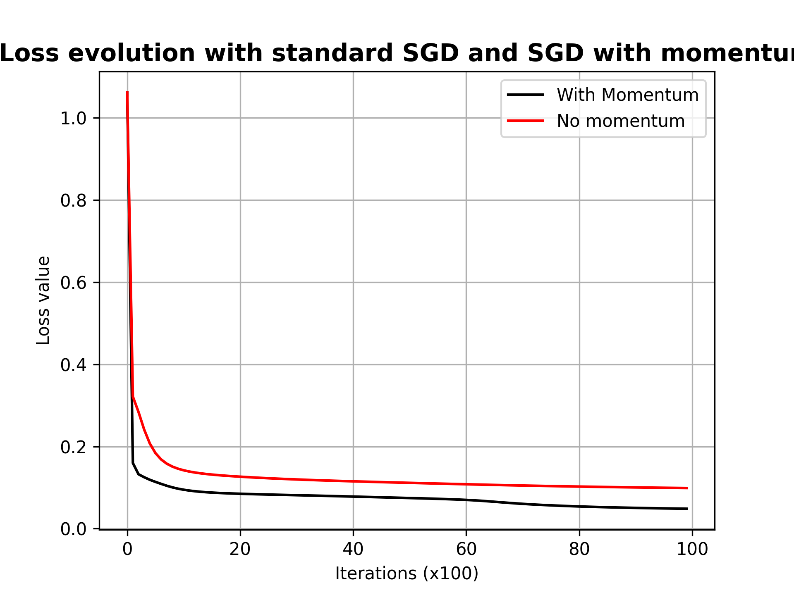

# Deep Learning Practice 1 report document

*Basic MLP implementation with Numpy/PyTorch using optimizers and autograd*

Group 8

Andreu Garcies (240618), Alejandro Fernández (242349), Marc Aguilar (242192)

## Exercise 1

## Exercise 2

### Implementation details

In this section we will focus on explaining what difficulties we encountered to justify our implementation choices. The foremost detail to remark is what **version of momentum we have decided to implement**. At first we settled for the version that multiplies the gradient by $1 - \beta$:

$$
\displaylines{
V_t = \beta V_{t-1} + (1-\beta)\nabla_wL(W, X, y) \\
W = W - \alpha V_t
}
$$

But after comparing the results with the standard Stochastic Gradient Descent we saw that the results were not as expected. After some thinking, we realised that we had forgotten about scaling the learning rate, otherwise its value was not comparable between exercises. To avoid this type of confusions, we thought that it was better to implement the second alternative, which uses a comparable learning rate:
$$
\displaylines{
V_t = \beta V_{t-1} + \alpha\nabla_wL(W, X, y) \\
W = W - V_t
}
$$
Other details that should be noted is that we have used a different moving average for each layer, because the weights update in each layer can be completely different. Furthermore, all $V_t$ are initialised to $0$ at the beginning. With this implementation, the result that we obtained was the following one:

It is clear that the addition of momentum has a positive effect, both in time required to reach the minimum and the minimum error that we get. It is important to note that we have used a fixed random seed to ensure that the results are easily comparable.

### Trying multiple values of $\beta$

When trying multiple values of $\beta$ we have also ensured to have the same random numbers for each test, to reduce as many distortion of the results as possible.

The result obtained is pretty straightforward to interpret. The higher the value of $\beta$ (up to $0.9$), the better the result. This should not come as a big surprise, as a small value of $\beta$ implies that we significantly reduce the effect of the momentum. This results is in line with the rule of thumb of using a beta of $0.9$ as a good starting point.

## Exercise 3

