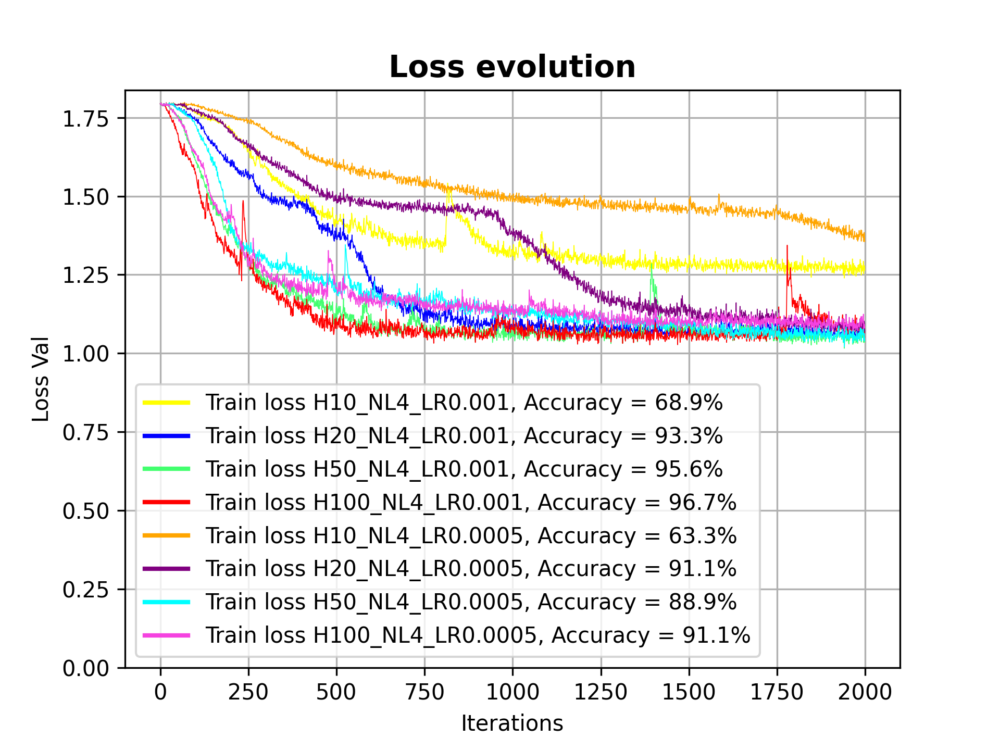

# Deep Learning Practice 2 report document

*RNNs and LSTMs*

Group 8

Andreu Garcies (240618), Alejandro Fernández (242349), Marc Aguilar (242192)

> **IMPORTANT NOTE**: We have decided to the A100 Colab Pro GPU with 40 GB for the last exercise. Therefore, with a GPU that has less memory it might not be possible to run the notebook.

# Exercise 1

## Training an RNN or LSTM.

### How have we adapted the classification loss and the SequenceClassifier module

In order to use the `SequenceClassifier` to solve our problem we modified the **last linear layer** and the **activation function**. 

First of all, after analyzing the shape of the data and the goal of our network we realized that in the last layer we needed at least as many neurons as classes we wanted to distinguish. Therefore, we added the parameter `n_classes` to both the class and the layer (`nn.Linear(hidden_size, n_classes)`). 

After the first modification and taking into account that we were solving a multiclass classification problem, the activation function which fitted the best was a **Softmax**, which directly returns probability that the sequence belongs to each of the classes. 

### How have we adapted the test function to compute the multi-class accuracy

For the confusion matrix we decided to use the `sklearn.metrics`, in particular the `confusion_matrix` and `ConfusionMatrixDisplay` modules. We used the first module to compute the values of the confusion matrix and the second one to plot the results. We have not modified the `test_sequence_classifier` function in any other meaningful way. One minor detail to remark is that any operation related to confusion matrices cannot be performed in the GPU. Therefore, given that the training process is done in the GPU, we need to move the corresponding data to the CPU prior to the confusion matrix computation. The different confusion matrices will be rpresented when analysing the results of the performance of the model.

## Experimenting with different hyperparameters.

In order to search for the best performance possible we tried multiple hyperparameter combinations, as well as some other alternatives like using bidirectional LSTMs and weight decay. Here we detail our exploration of several parameters and the results found:

- **Bias**: Using a bias parameter in the model consistently hurts performance, so it was rapidly discarded as a good option. This seems strange to us, although we have not had time to think more about it.

- **LSTM vs normal RNN**: Using LSTM instead of normal RNN is almost non-negotiable. During the hyperparameter exploration phase it provided much better results in a consistent manner. So, after some time, we stopped trying normal RNNs.

- **Optimizer used**: For this model we tried multiple optimizers from those available in `pytorch` (in fact, we tried all of them). Although we did not spend time fine-tuning each of the optimizers, we saw that the one that gave us the best immediate was `Adam`, so we continued with it. This result seems consistent with the literature, since Adam is commonly regarded as one of the best dynamic optimizers.

- **Number of layers**: After changing the number of layers in combination with multiple other parameters, we found that the best results were consistently achieved with 4 layers.

From this point onwards we present the hyperparameters that do not have as clear of a "best" value as the ones presented above.

- **Dropout**: At the beginning of the training process, we observed very inconsistent results. Minor changes in the hyperparameters produced very different results. To solve this, we tried to use dropout, which proved to be a great idea. A dropout around `0.05` increases the robustness of the model a lot, and it also improves the accuracy obtained in the test dataset. 

- **Learning rate ($\alpha$)**: We also tried multiple values for the learning rate. We found that any value above `1e-3` resulted in poor results, and anything much smaller was too slow to train without any added benefit.

- **Hidden size**: The size of the hidden layers does not seem to be as important as the other parameters. In general, it seems that values outside the `20-100` range start to lose performance, but the final result depends on the machine that is executing the code.

Other configurations tried that were removed in the end:

- **Bidirectional LSTM**: When we heard about bidirectional LSTMs, we thought that they were a perfect fit for our case (since a sinusoid can be "predicted" both when seeing from left to right as from right to left). However, when we used the `bidirectional=True` flag we actually observed a reduction in performance. We believe that with more time invested it could have potentially improved the results that we currently have.

- **Weight decay**: Another overfitting countermeasure that we tried was weight decay, which did not provide any valuable results. Dropout provided better results. Furthermore, weight decay in combination with dropout also reduced the final accuracy obtained by the model. So we decided to not use it at all.

The following image shows the loss evolution for the models with all the different hyperparameters that we tested:

</img>

From all the hyperparamters that we have previously explained that yield to the best results, we can see how the model with `4` hidden layers, of `50` neurons each and $\alpha$ = `0.001` is the one that generates better results. On the contrary, the model that produces the worst classification results is the one with `4` hidden layers of `10` neurons each and $\alpha$ = `0.0005`. The confusion matrices for both models are

</img>

>**NOTE:** this report does not include all the confusion matrices for all the models that we have tested. The rest can be found on the notebook

>**NOTE 2:** we have observed different results in different machines, but at least one of the 8 versions that we try gives an accuracy of 95% or higher.

# Exercise 2

## Discover the keyword & Verify it is the correct one

In order to discover the **keyword** we designed a very simple algorithm which computes the shift between both the plaintext and the cyphertext character by character. After running the algorithm in one pair of cypher and plaintext we discovered that the **keyword is PYTORCHPYTORCHPYTORCHPYTORCHPYTO**. We verified that encrypting with this keyword resulted in the same cyphertext for some of the pairs in the `test` dataset.

## Analyze the new dataset & Define the new alphabet

We can observe that the distribution of both **train and test** plaintexts is similar.

</img>

This is what we expected since none of them are corrupted, and they are both in English so they should follow a similar distribution. On the other hand, in the test cyphertext dataset we can observe how a **new character** arises ("-"), and is the most frequent one. The train cyphertext character distribution has no anomalies. This will cause some problems that will be addressed afterwards. 

The construction of the new alphabet was quite straightforward since we just had to add the new character ("-") to the abecedary.  

## Design/Implement a strategy to train the model so that it can be robust to missing characters in the testing samples

The first time that we executed the model (without modifying in any way the training dataset), we obtained the following results:

</img>

Even though it may seem like the model is performing significantly well (with an accuracy of $\approx 88\%$) we need to take the following into account: *$12.5\%$ of the sentences of the testing dataset have been corrupted*. This means that the model is facing some data that it has not seen during the training step, thus, it is very likely that it does not know how to handle it. Indeed, if we separate the accuracy in corrupted characters vs non-corrupted characters we see that the model has a very poor performance when it comes to predict the plaintext character of a corrupted character `-`. At most, it achieves a $\approx4\%$ accuracy, which means that the model is simply guessing the decryption of the decoded character $\frac{1}{26} = 3.8\%$. Moreover, notice that there is a huge discrepancy between the test loss and the training loss.

</img>

As we can see, the model has a considerable margin of improvement. In this section, we will explain the different strategies that we implemented to overcome this problem of missclassifying corrupted characters.

### Corrupting the training dataset

The training dataset does not come corrupted by default, so it is clear that we have to introduce hyphens in order to have a vocabulary that matches the one of the testing dataset. The question was, how much should we corrupt our training data?

As suggested in class, training the model with a harder task can help it to generalise better. During training we were able to confirm that this was indeed true. After testing some values, we found that a corruption ratio of `30%` provided quite better results than `12.5%` (which is the corruption ratio of the testing dataset).

As a note for reference, we tried with a corruption of `40%` and the model was not able to learn.

### Data augmentation and adding extra data

First of all we thought that the most straightforward approach was augmenting our initial training dataset by **corrupting it several times** with different corruption rates. After some tests we did not achieve good results, so we decided to increase our dataset by gathering new data.

#### Additional data 1 (first attempt)

We downloaded and parsed an English dictionary with a custom script (`sentencescleaner.py`). Then we extracted some dictionary definitions that at least have as many letters as our target length (32 characters). At the end we ended up with a new dataset of around **63K new sequences**, which can be found at `Data/our_training.pkl`.

#### Additional data 2 (second_attempt)

The problem of the previous approach is that most of the time cuts the last word in half, which can lead to a suboptimal training that actually performs worse than with the original 8000 sentences. Therefore, in order to solve this problem we have looked in another text corpus (*1-billion-word-language-modeling-benchmark*) for whole sentences that exactly have a length of 32 letters. With this technique, we have been able to obtain between 33,000 and 100,000 new sentences, depending on how strict we are of what is considered a "full sentence". You can find this dataset in `CustomData/sentences_32.txt` and `CustomData/sentences_32_notsoclean.txt`, respectively. The dataset is also converted to the required format by the practice in the respective `.pkl` files. You can also find the auxiliary python scripts in the `CustomData` folder.

#### Problems of using additional data

While we were doing hyper parameter modifications in order to improve the performance of the model, we saw that we ran out of GPU memory very quickly if using the additional data. After some tests with different amounts of additional data, we sadly realised that the benefits of it did not compensate how much we had to reduce the model size in order to fit it into the GPU memory.

However, it was clear for us that with enough GPU memory the results will eventually start to be better by using additional data. In order to satisfy our curiosity, we managed to find a way to run our Jupyter notebook with a better GPU of 40 GB of memory (With Google Colab Pro). As we will explain later, the effort was worth it.

### Bidirectional LSTM

In order to predict which character is missing in a sequence, it seems obvious that knowing information about the past characters but also of the future ones is more helpful than just having the previous ones. So, this is the reason why we implemented the bidirectional LSTM. 

In order to implement it we just set the flag `bidirectional_lstm` to `True` and we had to duplicate the sizes of the hidden states and of the last linear layer. We had to do this because now we had the "forward" LSTMs and the "backward" ones. 

### Dropout

Given the good results obtained in the first exercise, we decided to also implement dropout for this case. Once again, it appears to have very beneficial effects.

## Final results after playing with the hyperparameters

The goal of this section is to show the final specification of the model that we have used and its performance, considering all the different aspects that we have explained in the previous section. In the end we were able to use more than 40,000 sentences as our training dataset (the 8,000 original ones and the 33,000 sentences that we added).

The following table shows the characteristics of the model

| Parameter                | Value                       |
| ------------------------ | --------------------------- |
| Embedding size           | $20$                        |
| Number of hidden neurons | $65$                        |
| Number of layers         | $4$                         |
| LSTM                     | $\text{True}$               |
| Dropout                  | $0.05$                      |
| Bidirectional LSTM       | $\text{True}$               |
| Activation function      | $\text{Softmax}$            |
| Loss function            | $\text{Cross Entropy Loss}$ |
| Optimizer                | $\text{Adam}$               |

After $2000$ training iterations, the model manages an overall accuracy of $94.1\%$, correctly classifying the $99.89\%$ of the non-corrupted sentences and $53.8\%$ of the corrupted ones. The accuracy evolution can be seen in this graph:

</img>

We would like to remark that due to performance issues, we have only separately computed the accuracy for the corrupted and non-corrupted sentences every 50 iterations. Nevertheless, we can clearly see a big improvement, specially when it comes to properly predict the decrypted character of a corrupted one.

To conclude with the performance analysis, we can claim that the different strategies that we implemented and added to our model had a significant and positive impact on the overall performance. Not only we managed to achieve almost perfect performance for the non corrupted sentences in less training iterations:

| ORIGINAL non-corrupted accuracy     | FINAL non-corrupted accuracy        |
| ----------------------------------- | ----------------------------------- |
| $\approx 93\%$ in $1000$ iterations | $\approx 100\%$ in $400$ iterations |

but we also improved our model when it comes to predict corrupted characters, as it gained quite a bit of knowledge on how to handle them.

| ORIGINAL corrupted accuracy | FINAL corrupted accuracy |
| --------------------------- | ------------------------ |
| $\approx 6\%$               | $\approx 53.8\%$         |

However, we still believe that both having access to more resources to allow the model model to be bigger and using a larger (and/or more accurate dataset) could still result in a better performance.

> **NOTE**: We have not been able to plot the performance of all the different hyperparameter combinations that we have tested because we have limited compute units :'), and it also takes a lot of time.
