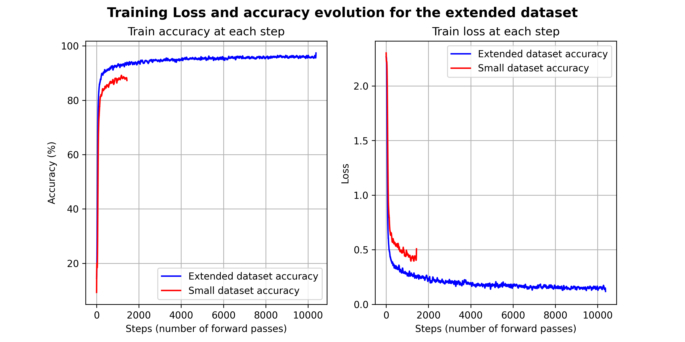
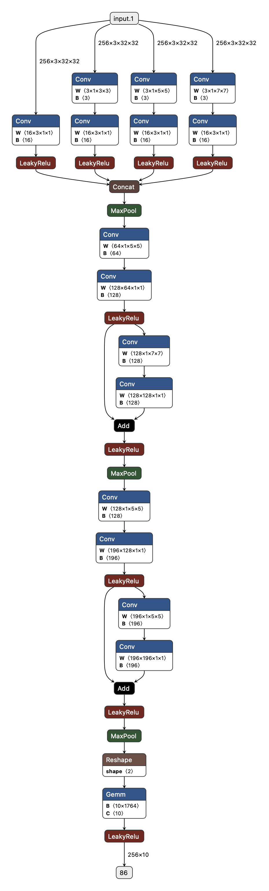
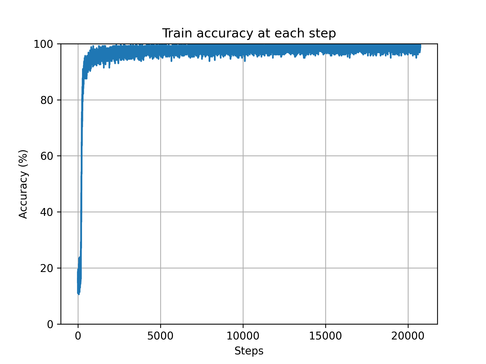

# Deep Learning Practice 3 report document

*Predicting house numbers with CNNs and the SVHN dataset*

Group 8

Andreu Garcies (240618), Alejandro Fernández (242349), Marc Aguilar (242192)

> **Environment note**: We have worked both in a local installation of `Python 3.10.9` and in Google Colab. The libraries used locally (and their version) can be found in the `requirements.txt` file. You can install these dependencies with the following command:
>
> ```bash
> python -m pip install --upgrade -r requirements.txt
> ```
>
> In order to better organize our code, we have designed a small set of auxiliary classes and functions that encapsulate some of the most repetitive tasks in a typical PyTorch workflow. This custom library (`MyTorchWrapper`) is appended with the rest of the code.

# Exercise 1

The goal of this exercise was to see how different hyperparameters affect the performance of a convolutional neural network (CNN) when classifying images. More precisely, the objective of the network was to properly classify images from the Street View House Numbers (SVHN) dataset. As the name says, these images contain numbers of houses. 

Initially, we were provided with a network with the following architecture

</img>

Using `Adam` as optimizer, with a learning rate ($\alpha$) of $0.001$, $5$ training epochs and batches of $256$ images, the accuracy for the testing dataset that the model achieved was a $\mathbf{86.16\%}$. The training loss and accuracies evolutions can be seen in the following plots

</img>

The result of plotting the losses and accuracies computed at the end of each trianing iteration resulted in a very noisy function. For this reason, we decided to use a smoothened version of the results that we obtian from training our models by applying a `Savitzky–Golay` filter. From this moment on, train and accuracy plots that this report will contain, will consist of the smoothened curves.

### Improving the accuracy of the model

When it comes to improving the accuracy of a model, there are many parameters that can be tuned. For this reason, this section has the goal to explain the most relevant conclusions that we obtained when trying and experimenting with different strategies to increase the performance of our model.

#### Learning rate

To be able to understand how the learning rate affected the model, we decided to use the same initial architecture and train it with different values of $\alpha$. The testing results for the values  $\alpha = [0.1, 0.01, 0.005, 0.001, 0.0001]$ can be seen in the following image

</img>

As we can see, for large values of $\alpha$, minimization of the error did not converge at all due to numerical instability and the model did not manage to learn. We observe errors related to exploding gradient. The optimal values for the learning rate are between $0.005$ and $0.001$. Higher or lower values may lead to either no, or to a verly slow convergence. However, regardless of the value of $\alpha$, the performance of the model was not significantly affected. This table shows the accuracy of the model on the testing dataset for the same experiments:

| Learning rate | Test accuracy (%) |
| :-----------: | :---------------: |
|      0.1      |       19.58       |
|     0.01      |       69.02       |
|     0.005     |       84.21       |
|   **0.001**   |     **86.05**     |
|    0.0001     |       79.34       |

#### Batch size

The batch size determines the number of images that will be used to perform a forward pass when training the network. The lower the batch size, the less images will be fed into a forward pass and the more parameter updates the network will perform. On the contrary, the higher the batch size, the less parameters updates will be done but the network will have seen more information when doing these updates. Trying with batch sizes of $16$, $32$, $64$, $128$, $256$ and $512$ images, we obtained these test accuracies:

| Batch size | Test accuracy (%) |
| :--------: | :---------------: |
|     16     |       86.78       |
|     32     |       87.11       |
|   **64**   |     **87.56**     |
|    128     |       86.91       |
|    256     |       86.05       |
|    512     |       85.14       |

It is true that there are some small differences between the different batch sizes. However, these are so small that we believe that we cannot attribute them to the batch size but to the numerical differences between each experiment. Moreover, when reducing the batch size the training process took a considerable higher amount of time.

#### Optimizers

We tested SGD and Adam. Depending on the hyperparameters used, SGD behaved quite poorly while Adam did not suffer that much the modifications. Furthermore, we were not able to find any learning rate that improved the results significantly. Therefore, we decided to continue with Adam since it gave us beter results overall.

#### Transformations

Pytorch, under the `torchvisions.transforms` module offers the possibility to apply transformations to the input images. We thought that it would be interesting to see how the training images look before deciding which transformations to apply.

</img>

As we can see, most of the images contain more than one digit. The one corresponding to the label of the image is usually the most centered one. Some of the numbers are slightly rotated and the contrast is not very good. For these reasons, we thought that the most useful transformations that could be applied were the **rotation** and the **solarize** (to try to achieve a better contrast in some images).

</img>

We did not expect these transformations to have much of an impact. Even though, we thought that the performance could be improved if rotating and changing the colors of the images happened to help the model to generalize better.

The results were not very promising, as the same network with the same architecture and same hyperparameters managed to achieve an accuracy of the $81.67\%$ for the testing dataset. Not only the accuracy reduced, but the overall training time increased as a transformation had to be applied to every image.

#### Training the model with the extended SVHN dataset

All the experiments so far have been done with the regular training and testing dataset. The training dataset conists of $73257$ digits and the testing dataset consists of $26032$ of them. However, we realized that in the official SVHN [website](http://ufldl.stanford.edu/housenumbers/), an extended dataset with $531131$ additional samples was provided.

So after a while of not arriving to good results, we thought that it was time to try the foolproof aproach of feeding the network with much more data. In the following figure we can see the results:

</img>

As we can see, both the training accuracy and the loss improved with more data. This had an impact on the final testing accuracy as well. Using the exended dataset, the network obtained an $88\%$ accuracy on the testing dataset. It should be noted, though, that the slim `2%` improvement does not seem worth the increase in computation time.

#### Changes in the architecture

As we have seen, tweaking the hyperparameters on our pursuit to improve the classification performance of our model resulted in marginal enhancements. Therefore, at this point we believed that the best way to improve the performance of the SVHN classification problem required to change the architecture of the network. Since this was the task of exercise 2, we decided to move on and focus our efforts in exercise 2.

# Exercise 2

## Introduction

In this exercise, we were forced to build a model that could perform accurately on the same problem as before, classifying the street-view housing numbers. With the **only** two restrictions that:

1. We could not change the hyperparameters that we were given.
2. We had a restriction on the number of parameters that the model could have. They could not exceed the number of **150K**.

As a reference, we were told that a decent testing accuracy of a $93\%$ could be achieved.

## First attempts (a failure after failure story)

First of all we started tinkering with the provided models in the examples by changing kernel sizes and adding or removing some layers. After trying dozens of different combinations we did not obtain any meaningful result. Our best result was a $90 \%$ accuracy with more than `150k` parameters.

Now that we have a bit more of perspective, it seems that we were too focused on following the common approach of doubling the number of channels while reducing the image resolution in half. Furthermore, we did not try more than 4 layers because the number of parameters grew too rapidly.

## Moving towards well-known architectures

Given the poor results obtained and the amount of time lost without any meaningful improvement, we decided to put more thought into our network design. So, as suggested in class, we read over the papers of some well-known architectures: [MobileNetV2](https://arxiv.org/pdf/1801.04381.pdf), [InceptionNet](https://arxiv.org/pdf/1409.4842v1.pdf ) and the [VGGNet](https://arxiv.org/pdf/1409.1556.pdf).

Our **first attempt** was to replicate the general structure of *MobileNetV2* (with a very simplified version of the bottleneck layer). Although we expected better results, we obtained a much worse result of around $60 \%$ of accuracy. Our immediate conclusion was that our simplifications were too extreme. Instead of putting more work into it, we decided to go back to VGG since it seemed a better starting point.

Our **second attempt** was to combine two already existing architectures, **Inception** and **VGG**. We first started with the naïve approach of joining the two models (so the output size of Inception had to match the VGG input). The results after the first executions were not better (around $89\%$) while the number of parameters increased a lot. At this point we had already been working in this problem for many hours. So, we decided to take a break, read more information and talk with our teacher.

Once again, since we did not obtain any meaningful result during this process, we do not find interesting to provide more details about this phase.

## Desinging the final model

### Depthwise Separable Convolutions

By the previous results, it seemed that we needed more than 4 layers to capture the necessary amount meaningful features of our images. However, we  still had the problem that adding more layers rapidly increases the number of parameters of the model. After talking with our teacher, we were told to investigate **depth-wise convolutions**, wich is a common approach but some of the famous networks previously mentioned to reduce the number of parameters of convolutional layers.

Using depthwise separable convolutions allows to drastically reduce the number of parameters of the model, without affecting its accuracy very much. For this reason, it seemed like a must for our model. These types of convolutions perform the regular convolution operation in two steps:

1. **Depth-wise convolution**: captures spatial information independently for each input channel.
2. **Point-wise convolution**: applied after the depth-wise convolution, it performs a linear combination of the channels.

An example of a well-known architecture that uses **Depthwise Separable Convolutions** is MobileNetV2, which is a popular CNN architecture specifically designed for efficient and lightweight image classification tasks on mobile and embedded devices.

### InceptionNet influence

One of the main characteristics of the InceptionNet is to apply filters of different sizes at the same level, with the objective to reduce up to some point the computational complexity of building deep neural networks. Given the advantages that this produces, we thought that it could be useful for our lightweight model.

### VGG influence

The last popular network that we thought that could be useful is VGG, which is a standard **deep** CNN with many layers. The power of concatenating many different convolutional layers has been shown to result in a very promising performance, at the cost of increasing the number of parameters.

## Final model architecture

With all the knowledge that we had gathered up to that point, and after playing a little bit with the parameters to ensure that we were under `150k` parameters, we built the following model:

</img>

### Droput

When we first tried to use the extended dataset with the baseline model (the one used in exercise 1), we saw overfitting problems. Therefore, we thought that implementing dropout and/or batch normalization could be an interesting addition to the model. In the end, after trying both separately, we decided to stick with dropout since it provided better results (we used `5%` of dropout).

At first we just used dropout for the fully connected layer, and then we discovered that it is also possible to add dropout to convolutional layers (with the `Dropout2d` class in PyTorch). We first tried using dropout after every single convolution, but we found that we obtained better results if we only used dropout after every group of convolutional layers.

We would have liked to try higher percentages of dropout and a combination of batch normalization with dropout, but at this point we had already invested a lot of time in the practice and felt that it would be more valuable to use our time in the final project of the subject.

### Training dataset used

At this point we had increased our accuracy to `91.7%`, which started to be decent but was still short of the goal of `93%`. Given that we had added dropout to the network, we felt that it was a good idea to **try once again to train the model with the extended SVHN dataset**, which we have already described previously in this document.

This time, the increase in computational time was worth it, wince we were able to jump to an accuracy of $\mathbf{95.3\%}$.

## Results and discussion

With the final design explained above we obtained an **accuracy of $95.34\%$**. This accuracy corresponds to the average accuracy of all the batches of the testing dataset (so some batches have higher accuracy and others have lower accuracy).

</img>

The following table inteds to summarize all the different parameters and their different values that were used during training.

| Parameter                            | Value                  |
| ------------------------------------ | ---------------------- |
| Batch size                           | $256$                  |
| Epochs                               | $5$                    |
| Learning rate                        | $0.1$                  |
| Optimizer                            | $\text{SGD}$           |
| Weight decay                         | $1\cdot 10^{-5}$       |
| Momentum                             | $0.9$                  |
| Loss function                        | $\text{Cross Entropy}$ |
| Dropout                              | $0.05$                 |
| VGG filter sizes                     | $5 \times 5$           |
| Image resolution of last CNN layer   | $3 \times 3$           |
| Number of channels of last CNN layer | $196$                  |
| FC layer size                        | $1746$                 |
| Number of parameters                 | $124,180$              |


As we can see in the previous table, we were able to have a large amount of channels by the end of our network, which we believe that is a big responsible for the good performance of the network. However, there's still room for improvement since some of the decisions do not seem optimal. For example, an image resolution of just $3 \times 3$ seems to low to be useful in any way and, as mentioned above, a dropout of $0.05$ is a bit too low.

By not reducing the image resolution that much we would have more parameters available in order to add another fully connected layer to our architecture. This could be benefitial to capture even better the high level features of our images. 


# Exercise 3

## Training base model

First of all we trained our previous model with data that contained numbers from 1 to 8. We used the parameters that were provided in the example code but we reduced the number of epochs to 10. 

| Parameter     | Value                  |
| ------------- | ---------------------- |
| Batch size    | $256$                  |
| Epochs        | $10$                    |
| Learning rate | $0.1$                  |
| Optimizer     | $\text{SGD}$           |
| Weight decay  | $1\cdot 10^{-5}$       |
| Momentum      | $0.9$                  |
| Loss function | $\text{Cross Entropy}$ |

## Fine-tuning the last FC layer

Our first attempt was to fine-tune only the last fully connected layer. We modified the output size to **2** so that only two classe (0s and 9s) were predicted. During the fine tuning we increased the **number of epochs to 20** but we kept all the previously mentioned parameters. Since we got only 200 training samples we considered that increasing the number of epochs would benefit the model performance. 

The results were pretty good since we got a $94.4 \%$ of accuracy on the test dataset of 0s and 9s. After the good results of fine-tuning only the last layer, we fine-tuned some of the convolutional ones in addition to this one. 

## Fine-tuning more than one layer

We started fine-tuning from the output layers of our model to the input ones. After trying with different selection of layers we did not get better results than in the previous part. Since we were fine-tuning more than one layer we slightly increased the number of epochs to **25**. The maximum accuracy we reached was $93.10 \%$.

When we were trying different combinations of layers we realized that the more layers we fine-tuned the worse the performance was. We considered that our actual model was already doing a good task at creating embeddings of the input images. The low-level features were captured good enough, that was the reason why our model performed so well by only finetuning the last fully connected layer.

In conclusion, if our model had more fully connected layers that captured the high level features of the images, we could have fine-tuned them and the performance could have slightly increased. On the other hand, we have observed that fine-tuning the convolutional layers does not improve the accuracy at all.


