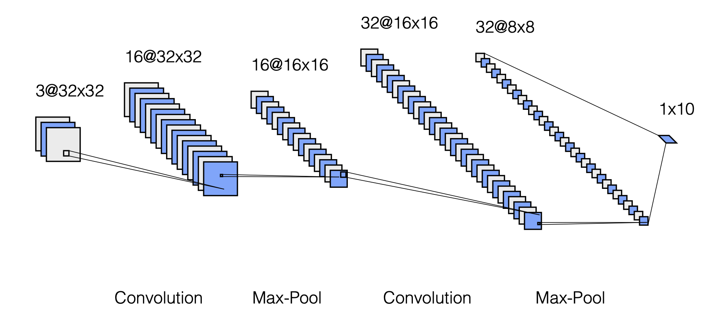
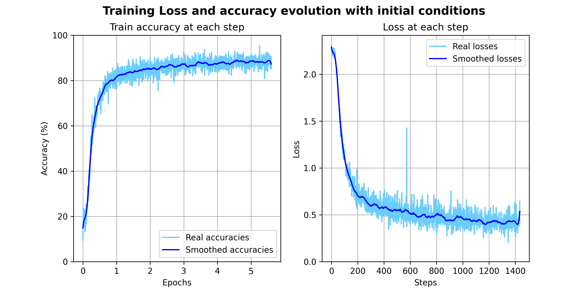
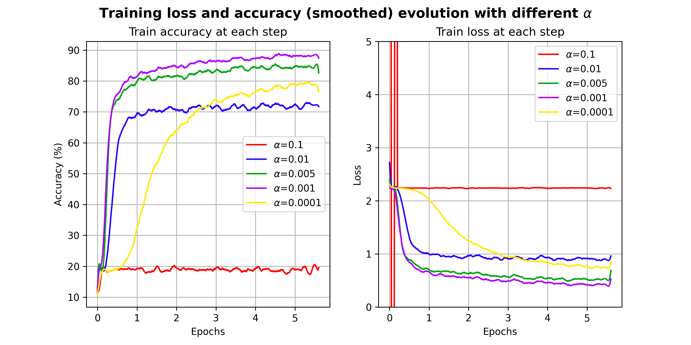
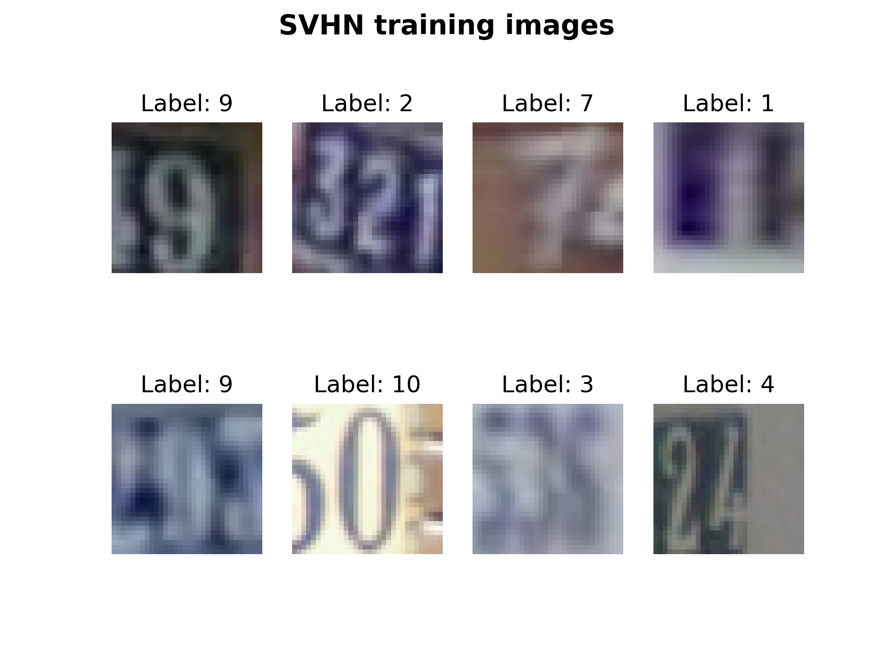
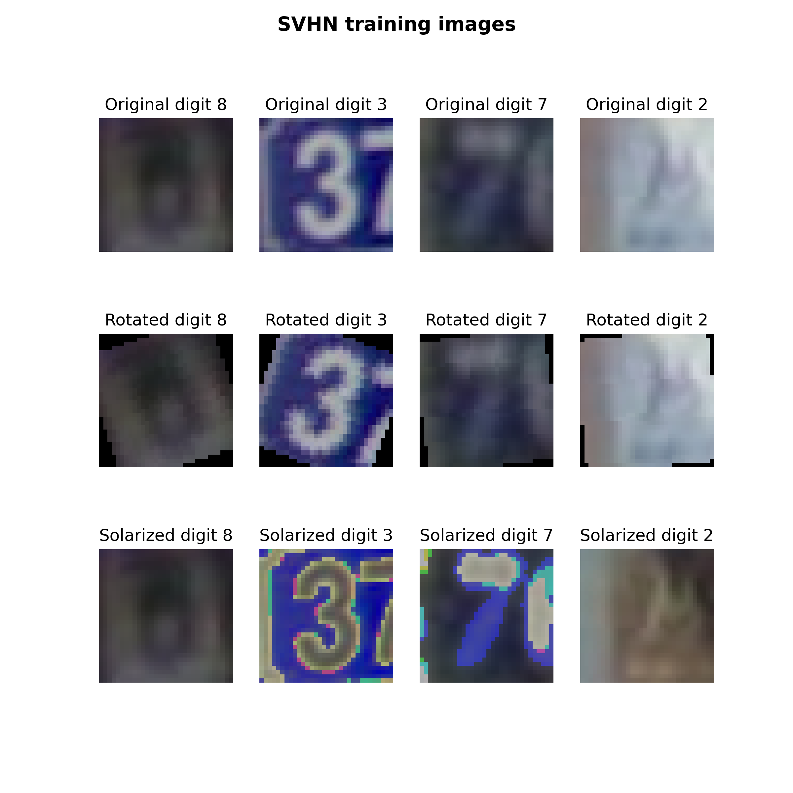

# Deep Learning Practice 3 report document

*Predicting house numbers with CNNs and the SVHN dataset*

Group 8

Andreu Garcies (240618), Alejandro Fernández (242349), Marc Aguilar (242192)

> **Environment note**: We have worked both in a local installation of `Python 3.10.9` and in Google Colab. The libraries used locally (and their version) can be found in the `requirements.txt` file. You can install these dependencies with the following command:
>
> ```bash
> python -m pip install --upgrade -r requirements.txt
> ```

# Exercise 1

The goal of this exercise was to see how different hyperparameters affect the performance of a convolutional neural network (CNN) when classifying images. More precisely, the objective of the network was to properly classify images from the Street View House Numbers (SVHN) dataset. As the name says, these images contain numbers of houses. 

Initially, we were provided with a network with the following architecture

</img>

Using `Adam` as optimizer, with a learning rate ($\alpha$) of $0.001$, $5$ training epochs and batches of $256$ images, the accuracy for the testing dataset that the model achieved was a $\mathbf{86.16\%}$. The training loss and accuracies evolutions can be seen in the following plots

</img>

The result of plotting the losses and accuracies computed at the end of each trianing iteration resulted in a very noisy function. For this reason, we decided to use a smoothened version of the results that we obtian from training our models by applying a `Savitzky–Golay` filter. From this moment on, train and accuracy plots that this report will contain, will consist of the smoothened curves.

### Improving the accuracy of the model

When it comes to improving the accuracy of a model, there are many parameters that can be tuned. For this reason, this section has the goal to explain the most relevant conclusions that we obtained when trying and experimenting with different strategies to increase the performance of our model.

#### Learning rate

To be able to understand how the learning rate affected the model, we decided to use the same initial architecture and train it with different values of $\alpha$. The testing results for the values  $\alpha = [0.1, 0.01, 0.005, 0.001, 0.0001]$ can be seen in the following image

</img>

As we can see, for large values of $\alpha$, minimization of the error did not converge at all due to numerical instability and the model did not manage to learn. We observe errors related to exploding gradient. The optimal values for the learning rate are between $0.005$ and $0.001$. Higher or lower values may lead to either no, or to a verly slow convergence. However, regardless of the value of $\alpha$, the performance of the model was not significantly affected. This table shows the accuracy of the model on the testing dataset for the same experiments:

| Learning rate | Test accuracy (%) |
| :-----------: | :---------------: |
|      0.1      |       19.58       |
|     0.01      |       69.02       |
|     0.005     |       84.21       |
|   **0.001**   |     **86.05**     |
|    0.0001     |       79.34       |

#### Batch size

The batch size determines the number of images that will be used to perform a forward pass when training the network. The lower the batch size, the less images will be fed into a forward pass and the more parameter updates the network will perform. On the contrary, the higher the batch size, the less parameters updates will be done but the network will have seen more information when doing these updates. Trying with batch sizes of $16$, $32$, $64$, $128$, $256$ and $512$ images, we obtained these test accuracies:

| Batch size | Test accuracy (%) |
| :--------: | :---------------: |
|     16     |       86.78       |
|     32     |       87.11       |
|   **64**   |     **87.56**     |
|    128     |       86.91       |
|    256     |       86.05       |
|    512     |       85.14       |

It is true that there are some small differences between the different batch sizes. However, these are so small that we believe that we cannot attribute them to the batch size but to the numerical differences between each experiment. Moreover, when reducing the batch size the training process took a considerable higher amount of time.

#### Optimizers

#### Transformations

Pytorch, under the `torchvisions.transforms` module offers the possibility to apply transofrmations to the input images. We thought that it would be interesting to see how the training images look before deciding which transofrmations to apply.

</img>

As we can see, most of the images contain more than one digit. The one corresponding to the label of the image is usually the most centered one. Some of the numbers are slightly rotated and the contrast is not very good. For these reasons, we thought that the most useful transformations that could be applied were the **rotation** and the **solarize** (to try to achieve a better contrast in some images).

</img>

We did not expect these transformations to have much of an impact. Even so, we thought that the performance could be improved if rotating and changing the colors of the images happened to help the model to gerenalize better.

#### Training the model with the extended SVHN dataset


#### Changes in the architecture

As we have seen, tweaking the hyperparameters on our pursuit to improve the classification performance of our model resulted in marginal enhancements. Therefore, at this point we believed that the best way to improve the performance of the SVHN classification problem required to change the architecture of the network. In this section of the report we will explain the ones that yielded to the best results.

<span style="color:red">ARCHITECTURES THAT WE TESTED, NUMBER OF PARAMETERS, TESTING DATASET ACCURACY</span>


