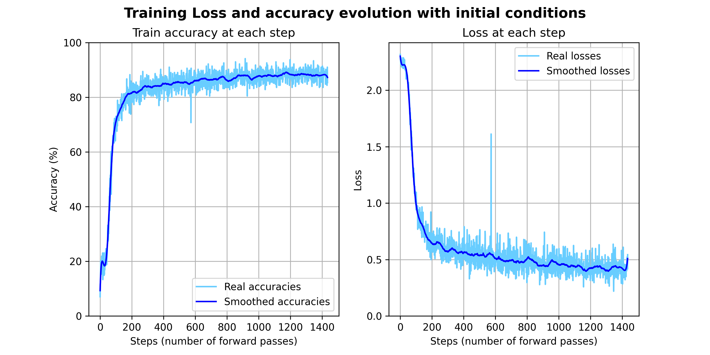

# Deep Learning Practice 3 report document

*Predicting house numbers with CNNs and the SVHN dataset*

Group 8

Andreu Garcies (240618), Alejandro Fernández (242349), Marc Aguilar (242192)

> **Environment note**: We have worked both in a local installation of `Python 3.10.9` and in Google Colab. The libraries used locally (and their version) can be found in the `requirements.txt` file. You can install these dependencies with the following command:
>
> ```bash
> python -m pip install --upgrade -r requirements.txt
> ```

# Exercise 1

The goal of this exercise was to see how different hyperparameters affect the performance of a convolutional neural network (CNN) when classifying images. More precisely, the objective of the network was to properly classify images from the Street View House Numbers (SVHN) dataset. As the name says, these images contain numbers of houses. 

Initially, we were provided with a network with the following architecture

</img>

Using `Adam` as optimizer, with a learning rate ($\alpha$) of $0.001$, $5$ training epochs and batches of $256$ images, the accuracy for the testing dataset that the model achieved was a $\mathbf{86.16\%}$. The training loss and accuracies evolutions can be seen in the following plots

</img>

The result of plotting the losses and accuracies computed at the end of each trianing iteration resulted in a very noisy function. For this reason, we decided to use a smoothened version of the results that we obtian from training our models by applying a `Savitzky–Golay` filter. From this moment on, train and accuracy plots that this report will contain, will consist of the smoothened curves.

### Improving the accuracy of the model

When it comes to improving the accuracy of a model, there are many parameters that can be tuned. For this reason, this section has the goal to explain the most relevant conclusions that we obtained when trying and experimenting with different strategies to increase the performance of our model.

#### Learning rate

To be able to understand how the learning rate affected the model, we decided to use the same initial architecture and train it with different values of $\alpha$. The testing results for the values  $\alpha = [0.1, 0.01, 0.005, 0.001, 0.0001]$ can be seen in the following image

</img>

As we can see, for large values of $\alpha$, minimization of the error did not converge at all due to numerical instability and the model did not manage to learn. We observe errors related to exploding gradient. The optimal values for the learning rate are between $0.005$ and $0.001$. Higher or lower values may lead to either no, or to a verly slow convergence. However, regardless of the value of $\alpha$, the performance of the model was not significantly affected. This table shows the accuracy of the model on the testing dataset for the same experiments:

| Learning rate | Test accuracy (%) |
| :-----------: | :---------------: |
|      0.1      |       19.58       |
|     0.01      |       69.02       |
|     0.005     |       84.21       |
|   **0.001**   |     **86.05**     |
|    0.0001     |       79.34       |

#### Batch size

The batch size determines the number of images that will be used to perform a forward pass when training the network. The lower the batch size, the less images will be fed into a forward pass and the more parameter updates the network will perform. On the contrary, the higher the batch size, the less parameters updates will be done but the network will have seen more information when doing these updates. Trying with batch sizes of $16$, $32$, $64$, $128$, $256$ and $512$ images, we obtained these test accuracies:

| Batch size | Test accuracy (%) |
| :--------: | :---------------: |
|     16     |       86.78       |
|     32     |       87.11       |
|   **64**   |     **87.56**     |
|    128     |       86.91       |
|    256     |       86.05       |
|    512     |       85.14       |

It is true that there are some small differences between the different batch sizes. However, these are so small that we believe that we cannot attribute them to the batch size but to the numerical differences between each experiment. Moreover, when reducing the batch size the training process took a considerable higher amount of time.

#### Optimizers


#### Transformations

Pytorch, under the `torchvisions.transforms` module offers the possibility to apply transofrmations to the input images. We thought that it would be interesting to see how the training images look before deciding which transofrmations to apply.

</img>

As we can see, most of the images contain more than one digit. The one corresponding to the label of the image is usually the most centered one. Some of the numbers are slightly rotated and the contrast is not very good. For these reasons, we thought that the most useful transformations that could be applied were the **rotation** and the **solarize** (to try to achieve a better contrast in some images).

</img>

We did not expect these transformations to have much of an impact. Even though, we thought that the performance could be improved if rotating and changing the colors of the images happened to help the model to gerenalize better.

The results were not very promising, as the same network with the same architecture and same hyperparameters managed to achieve an accuracy of the $81.67\%$ for the testing dataset. Not only the accuracy reduced, but the overall training time increased as a transformation had to be applied to every image.

#### Training the model with the extended SVHN dataset

All the experiments so far have been done with the regular training and testing dataset. The training dataset conists of 73257 digits and the testing dataset consists of 26032 of them. However, we realized that in the official SVHN [website](http://ufldl.stanford.edu/housenumbers/), an extended dataset with 531131 additional samples (less difficult to classify) was provided. Therefore, we thought that it could be a very good approach to feed the network with more and easier images during training.

</img>

DISCUTIR QUE FER AMB AQUESTS RESULTATS: <span style="color:red">**As we can see, both the training accuracy and the loss improved with more data. However, the final test accuracy of the model was significantly lower, a $77.31\%$. We believe that this is because the training dataset contains more simpler images than the testing dataset. Thus, it is difficult for the network to generalize the knowledge acquired during training.**</span>

#### Changes in the architecture

As we have seen, tweaking the hyperparameters on our pursuit to improve the classification performance of our model resulted in marginal enhancements. Therefore, at this point we believed that the best way to improve the performance of the SVHN classification problem required to change the architecture of the network. In this section of the report we will explain the ones that yielded to the best results.

<span style="color:red">ARCHITECTURES THAT WE TESTED, NUMBER OF PARAMETERS, TESTING DATASET ACCURACY</span>

# Exercise 2

### Introduction

As we have seen at the end of exercise 1, modifying the architecture by adding more layers can rapidly increase the number of parameters of the model. In this exercise, we were forced to build a model that could perform accurately on the same problem as before, classifying the street-view housing numbers. With the **only** two restrictions that:

1. We could not change the hyperparameters that we were given.
2. We had a restriction on the number of parameters that the model could have. They could not exceed the number of **150K**.

As a reference, we were told that a decent testing accuracy of a $93\%$ could be achieved. To be able to succeed on this task, we took inspiration on some well-known CNN architectures: [MobileNetV2](https://arxiv.org/pdf/1801.04381.pdf), [InceptionNet](https://arxiv.org/pdf/1409.4842v1.pdf ) and the [VGGNet](https://arxiv.org/pdf/1409.1556.pdf).

MobileNetV2 is a popular CNN architecture specifically designed for efficient and lightweight image classification tasks on mobile and embedded devices. One of the characteristics of this network is the usage of **Depthwise Separable Convolutions** in order to reduce the number of parameters of a convolutional layer. These types of convolutions perform the regular convolution operation in two steps:

1. *Depth-wise convolution*: captures spatial information independently for each input channel.
2. *Point-wise convolution*: applied after the depth-wise convolution, it performs a linear combination of the channels.

Using depthwise separable convolutions allows to drastically reduce the number of parameters of the model, without affecting its accuracy very much. For this reason, we decided that this was a must for our model.

One of the main characteristics of the InceptionNet is to apply filters of different sizes at the same level, with the objective to reduce up to some point the computational complexity of building deep neural networks. Given the advantages that this produces, we thought that it could be useful for our lightweight model.

The last popular network that we thought that could be useful is VGG, which is a standard **deep** CNN with many layers. The power of concatenating many different convolutional layers has been shown to result in a very promising performance, at the cost of increasing the number of parameters.

Having considered some of the state of the art architectures, we built the following model:

### Architecture

<span style="color:red">IMATGE, DIAGRAMA O DIBUIX ON ES PUGUI VEURE L'ARQUITECTURA DEL MODEL</span>

<span style="color:red">COMENTAR DROPOUT</span>

As the contrary was not mentioned, and the only restrictions imposed were the two ones previously mentioned, we decided to train our model with the extended dataset that we have already described in this document.

### Results

The following table inteds to summarize all the different parameters and their different values that were used during training.

| Parameter     | Value                  |
| ------------- | ---------------------- |
| Batch size    | $256$                  |
| Epochs        | $5$                    |
| Learning rate | $0.1$                  |
| Optimizer     | $\text{SGD}$           |
| Weight decay  | $1\cdot 10^{-5}$       |
| Momentum      | $0.9$                  |
| Loss function | $\text{Cross Entropy}$ |

<span style="color:red">COMENTAR RESULTATS. MAYBE ALGUNA GRÀFICA?</span>

# Exercise 3


