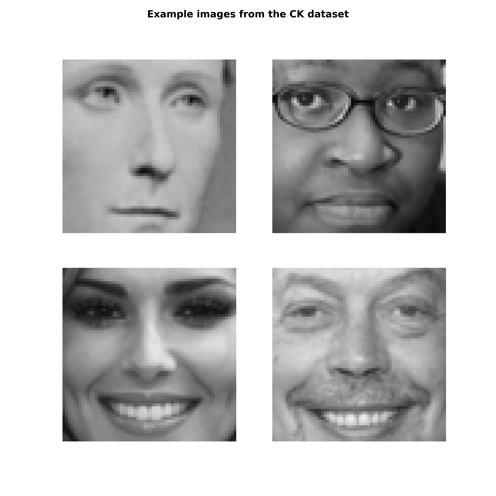
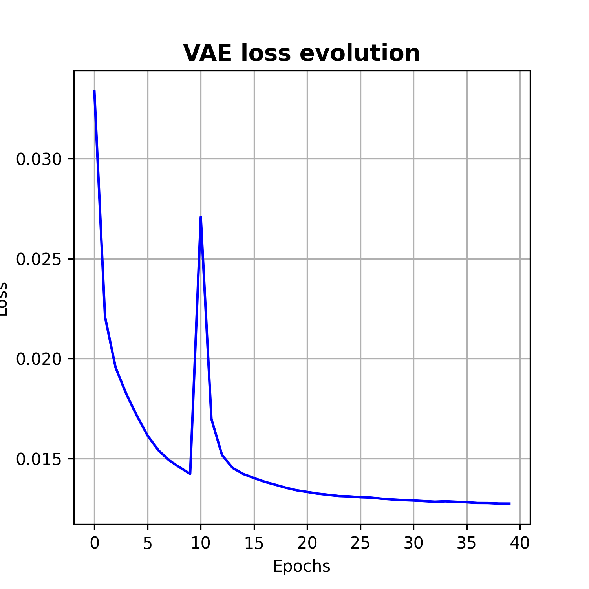
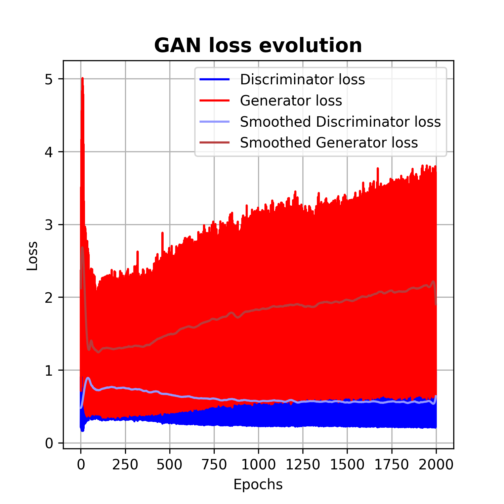

# Deep Learning Practice 4 report document

*Deep Generative Models: Variational Autoencoders (VAEs) and Generative Adversarial Networks (GANs)*

Group 8

Andreu Garcies (240618), Alejandro Fernández (242349), Marc Aguilar (242192)

> **Environment note**: We have worked both in a local installation of `Python 3.10.9` and in Google Colab. The libraries used locally (and their version) can be found in the `requirements.txt` file. You can install these dependencies with the following command:
>
> ```bash
> python -m pip install --upgrade -r requirements.txt
> ```
>
> In order to better organize our code, we have moved the model definitions (the VAE model and the GAN model) to a separate package called `architectures`. The folder with the python scripts is appended with the rest of the code.
>
> Furthermore, we also reuse some functions of our custom library (`MyTorchWrapper`) designed for practice 3. We have delivered it with the rest of the code.

# Exploring the dataset

The dataset used for this practice is the [Cohn-Kanade](http://www.jeffcohn.net/wp-content/uploads/2020/02/Cohn-Kanade_Database.pdf.pdf) (CK) dataset. It is a dataset originally intended for facial expression analysis. Nevertheless, in this practice we will use it to train our models to generate faces. The dataset contains 50000 64x64 grayscale images. The following image shows some examples:

</img>

# Exercise 1

The objective of this exercise was to train a Variational Autoencoder (VAE) and analyse its performance evolution with the task of generating faces.

## Trying different KL weights

Initially, we saw that there was a significant difference between the reconstructed loss and the Kullback–Leibler (KL) divergence. This meant that while the model was able to reconstruct the input data, the latent space was not efficiently fitting the prior distribution thus the model was under-regularized.

In our effort to try to reduce the KL, we tried different values for the weight of the KL term contribution to the overall loss computation $\text{overall\_loss = reconstruction\_loss + weight * kl\_loss}$. As mentioned in [this](https://arxiv.org/pdf/2002.07514.pdf) paper, we thought that this may benefit our model.

With a KL weight of $0.01$, after $100$ training epochs the KL value was $\approx 0.5$. This is a signigicant lower value than the previous one that we had $\approx 4$ with a weight factor of $0.001$. However, we realized that the lowe the KL value, the higher was the reconstruction error and therefore, the worst were the final generated and reconstructed images.

## Analysing the loss evolution for the final model

With all these considerations being made, in the end we chose to have a lower reconstruction error at the cost of having a higher KL loss as the results were visually better. Ideally, a tradeoff between both terms should be achieved, the value of which depends on each specific use case.

The following image shows both the reconstruction and the KL loss evolution during the training process.

</img>

As we can see, the reconstruction loss deacreases until its convergence. However, it is more interesting to observe the behaviour of the KL loss. After a period of decreasing, it starts increasing in the middle of the training phase. If we look at the curve, it looks like a significant change. However, by observing the y-axis scale we realize that the growth is not that excessive and thus it does not affect to the performance of the overall model.


## Reconstructed images

The following images show the reconstructed images of the VAE for the 20th and 100th training epoch along with the original ones.

</img>

As we can see, the quality of the faces significantly improve as the training iterations increase (as expected). Although the tonality of contour of the face was already captured at epoch 20, at epoch 100 we see that there is a noticeable increase in the details of the image. However, not all reconstructed faces are similar to the original images, but adding more trainig epochs has not resulted in better results.

## Generated images

Generated images at epoch 20:

</img>

Generated images at epoch 100:

</img>

As it was the case for the reconstructed images, we can also perceive an improvement in the generated images. We can clearly see that at the beginning, the faces are more generic and similar between them. But as we leave the model training for more epochs, the results appear to be better and they are far less generic. More details are present in the faces and there is an increased perception of realism.

## Training summary

This table shows a final summary of the final values that were used to train our VAE:

| Parameter                            | Value                  |
| ------------------------------------ | ---------------------- |
| Batch size                           | $2500$                  |
| Epochs                               | $100$                    |
| Learning rate                        | $0.0005$                  |
| KL weight                        | $0.001$                  |
| Optimizer                            | $\text{Adam}$           |
| Weight decay                         | $1\cdot 10^{-5}$       |
| Loss function                        | $\text{MSE loss}$ and $\text{KL loss}$|
| Dropout                              | $0.2$                 |


# Exercise 2


We started exercise 2 with the same naïve approach of copying the code used in the example notebook. With a minor modifications we were able to adapt it to the CK dataset. However, we immediately encountered one big problem, the training process was **very unstable**. This meant that after some training epochs, both the generator and discriminator loss encountered **numerical issues** (reaching a value of infinity). Furthermore, we also observed big spikes in the training loss and little signs of convergence (when the model was able to train for some epochs before crashing).

## Steps taken to stabilise training

### Change when to train the Discriminator and when to train the Generator

When we were playing with the base code provided in the examples, we had one execution in which the model didn't explode due to numerical instability. Furthermore, both the Generator loss and the Discriminator loss converged to a similar value. However, the generated images were horrendous, more monster-like than human-like. **Our conclusion of this result was that the performance of the Discriminator was very poor, and that perhaps we needed to train it more than the Generator**.

By default, the example code intercalates training between the Generator and the Discriminator every batch. Our first modification was to change this from every batch to every epoch, since we had enough computational resources to run the model for a large number of epochs. We changed this because we believed that training with the whole dataset instead of just a batch could improve stability. However, this modification alone did not result in any noticeable improvement. However, after having implemented some additional modifications mentioned in the following section, we were able to conclude that this solution had better performance than the original one.

Our next step was to unbalance the training and train the Discriminator for $k$ epochs, and then train the generator for just $1$ epoch. We have tried with values for $k$ in the range of $[2, 10]$, but none of them have helped to stabilise the training nor to improve the quality of the generated images.

### Research about common GAN-training practices

At this point it was time to do some research. We found a well-known paper (Radford et al., 2016) that provides some simple tips to improve the stability of GAN training, and they call the result DCGAN. Since the guidelines provided were simple enough, we decided to give it a try. Furthermore, we also found a pytorch tutorial (https://pytorch.org/tutorials/beginner/dcgan_faces_tutorial.html) in which they explain how to implement the suggestions of the paper. These are all the tips that we tried:


- Randomly **initialise the model weights** from a Normal distribution with `mean=0`, `stdev=0.02`.

- Use the `LeakyReLU` activation function for the discriminator, instead of `ReLU`, with a slope of `0.2`.

- Use a `tanh` activation for the output of the generator instead of a `sigmoid`. This change has a very positive effect in avoiding numerical instability.

- Use **strided convolutions** instead of pooling layers.

- **Remove fully-connected layers** and simply flatten the output to obtain the desired output size.

- In the Adam optimizer, use `beta1=0.5` instead of the default `0.9` value.

It should be noted that the paper also puts a lot of emphasis in using **batch normalisation**, but it was already implemented in the code provided in the examples. It also suggests to use the **Adam optimizer**, which the example code already uses by default.

### Additional measures of our own

We have also used a dropout of `0.1` between each layer of the Discriminator, since it is another good practice of Deep Learning that has shown good results in all of the previous practices of the subject. We have tested higher values of dropout as well, but anything higher than `0.3` resulted in some distortion in the output images.

We have also tested adding dropout to the generator, but even small percentages of dropout produce certain artifacts in the images. While searching a little bit on the internet we read that it is uncommon to use dropout in the Generator because it can hinder its performance.

Finally, since we had enough computational resources, we have also tried to run the GAN without resizing the input images to `32x32`, and leave them at their default resolution of `64x64`. Although the training process becomes slower, the results are a bit better, so we have decided to keep the original resolution.

## Results

Having implemented all the previously mentioned measures, we could observe a significant stabilization during training. We could train the model for many epochs without having numerical problems anymore. The following image shows both the generator and discriminartor loss evolution during the $2000$ training epochs.

</img>

As it can be observed, the generator loss increases more than we initally expected. We are not entirely sure about how to interpret this result, but it could mean that the generator should be training more than the discriminator in some phases. However we tried using a training ratio of 1:2 (for each epoch that the discriminator is trained, the generator trains for two), but the training process was more unstable and the results were worse. We also tried to follow this ratio after 1000 epochs of 1:1 training, but it was a failure as well.

However, it should be noted that despite the increase of the generator loss, the results at each epoch get better (more information about the images in the following section). So our conclusion has been that this result simply comes from the adversarial nature of GANs. Since the generator loss depends directly on the discriminator's performance (and the discriminator gets better at every step), it increases but it does not necessarily mean that the generated faces are getting worse (as we will see next).

This is not an ideal result though, the generator loss should decrease more, but perhaps we've reached a limitation of the architecture of the generator. It is important to realise that the generator that we use is a very simple CNN, and perhaps a more complex architecture would improve the results. We leave this research as future work.

## Generated images

As we can observe in following figure, most of the generated images at **epoch 200** have somehow the structure of a face since the nose, the eyes and the mouth are well defined. Despite this, the faces are still very distorted. 

</img>

At the **epoch 1200**, we can observe how the model has noticeably improved. The biggest difference between both figures is that the faces of the latter are much smoother than before. Despite they have a lot of distortion yet, they keep the face structure and some of them have a clear representation of the eyes, the nose and the mouth. 

Something that has surprised us is that the model has been able to generate some faces with glasses which are quite well defined at this stage of the training. This has only happened when using a resolution  of `64x64`. When we tried a resolution of `32x32` we did not see any sort of glasses.

</img>

Finally, the following image shows the faces generated in the **last epoch (2000)**. As we can observe, there is not a significant difference between the epoch `1200` and the `2000`. This was something we could envision from the loss, since it does not improve significantly from epoch `1000`.  Despite the results are similar, the structure of the faces is better defined for most of the cases.

</img>

## Training summary

This table shows a final summary of the final values that were used to train our VAE:

| Parameter                            | Value                  |
| ------------------------------------ | ---------------------- |
| Batch size                           | $2500$                  |
| Epochs                               | $2000$                    |
| Learning rate                        | $0.0002$ (both the Discriminator and the Generator)                 |
| Optimizer                            | $\text{Adam}$ with $\beta_1 = 0.5$          |
| Weight decay                         | $1\cdot 10^{-5}$       |
| Loss function                        | $\text{mini-max loss}$|
| Dropout                              | $0.1$ for the Discriminator                 |
| Resolution of images | $64 \times 64$|
| Activation function | LeakyReLU for the Discriminator, ReLU for the Generator |
| Training ratio (Discriminator:Generator) | $1:1$ |


# References and Resources

In our process of stabilizing the learning process of the GAN, we have consulted the following resources which we have found useful.

- Tips for Training Stable Generative Adversarial Networks: https://machinelearningmastery.com/how-to-train-stable-generative-adversarial-networks/

- Radford, A., Metz, L., & Chintala, S. (2015). Unsupervised representation learning with deep convolutional generative adversarial networks. arXiv preprint arXiv:1511.06434.

- Why not to use a loss threshold for the discriminator: https://developers.google.com/machine-learning/gan/training#convergence

- Good theory resource: https://developers.google.com/machine-learning/gan

- Pytorch tutorial: https://pytorch.org/tutorials/beginner/dcgan_faces_tutorial.html