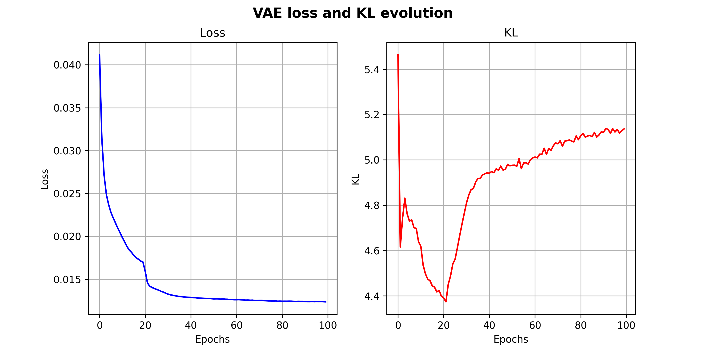

# Deep Learning Practice 4 report document

*Deep Generative Models: Variational Autoencoders (VAEs) and Generative Adversarial Networks (GANs)*

Group 8

Andreu Garcies (240618), Alejandro Fernández (242349), Marc Aguilar (242192)

> **Environment note**: We have worked both in a local installation of `Python 3.10.9` and in Google Colab. The libraries used locally (and their version) can be found in the `requirements.txt` file. You can install these dependencies with the following command:
>
> ```bash
> python -m pip install --upgrade -r requirements.txt
> ```
>
> In order to better organize our code, we have designed a small set of auxiliary classes and functions that encapsulate some of the most repetitive tasks in a typical PyTorch workflow. This custom library (`MyTorchWrapper`) is appended with the rest of the code.

# Exploring the dataset

The dataset used for this practice is the [Cohn-Kanade](http://www.jeffcohn.net/wp-content/uploads/2020/02/Cohn-Kanade_Database.pdf.pdf) (CK) dataset. It is a dataset originally intended for facial expression analysis. Nevertheless, in this practice we will use it to train our models to generate faces. The dataset contains 50000 64x64 grayscale images. The following image shows some examples:

</img>

# Exercise 1

The objective of this exercise was to train a Variational Autoencoder (VAE) and analyse its performance evolution with the task of generating faces.

After training the model for <span style="color:red">xxxxx epochs</span>, we manage to obtain a reconstruction error of <span style="color:red">xxx</span> and the value for the Kullback–Leibler (KL) divergence is <span style="color:red">xxx</span>. The following graphic shows its evolution during the <span style="color:red">xxxx</span> training epochs.

</img> <span style="color:red">update with the proper image</span>

As we can see, 

# Exercise 2


How to stabilize training: https://machinelearningmastery.com/how-to-train-stable-generative-adversarial-networks/

Why not to use a loss threshold for the discriminator: https://developers.google.com/machine-learning/gan/training#convergence

Good theory resource: https://developers.google.com/machine-learning/gan

Pytorch tutorial: https://pytorch.org/tutorials/beginner/dcgan_faces_tutorial.html